  

  
  
  
  
  

  

<h1 align="left">
  
</h1>

- :mortar_board: **Associate Degree** in **Mechanical Engineering**
- :gear: Experienced with **CNC (2-axis & 3-axis)**, Milling, Lathe, CAD (Autodesk, Dassault)
- :robot: Kinda do a bit **Coding** (Arduino, HTML, type shi)
- :trophy: Licensed **Mechanical Maintenance Technician** (LSP LMI)
- :chart_with_upwards_trend: English Score: **865/990** (TOEIC)
- :jp: Language: **Japanese (N4 Level)**
- :bulb: Fun fact: **"larping doesn't hurt anyone if its good inaff"**

 

  

## :hammer_and_wrench: Tech Stack & Tools

  

  

  

## :books: Academic Projects

| Project | Description |
|:--------|:-----------|
| **1-Ton Jib Crane** | Full mechanical design, stress analysis & fabrication |
| **PEDC-06 Nano Carbon Machine** | Manufacturing & assembly of nano carbon processing equipment |

  

## :tv: Anime Type Shi

  

  Auto-updated daily via GitHub Actions | <a href="https://myanimelist.net/profile/RFA-Chan">View MAL Profile</a>

  

## :bar_chart: GitHub Stats

  
  

  

  

  "Life is like a box of chocolates - you never know what you're gonna get."

  

